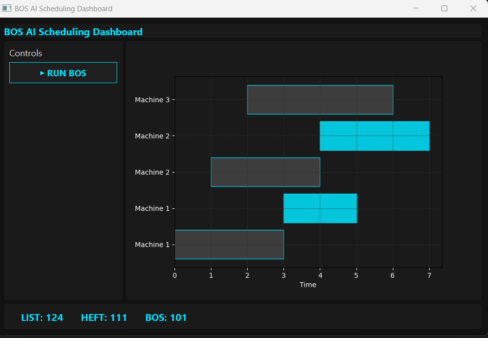

# BOS-Greedy
**Bottleneck-Oriented Overlap Scheduling（Greedy Baseline）**  
**瓶頸導向可重疊排程（貪婪基準實作）**

## ▶ Dashboard Demo




---

## 📌 Overview ｜ 專案概述

### English

**BOS-Greedy** is a greedy baseline implementation of **Bottleneck-Oriented Overlap Scheduling (BOS)**, a scheduling framework designed for **multi-level BOM systems with partial assembly overlap**.

This project focuses on scheduling problems where:

- Tasks are represented as a **Directed Acyclic Graph (DAG)**
- Precedence constraints allow **partial availability / overlap**
- The makespan is dominated by **dynamic bottleneck paths**, not static longest paths

Traditional list scheduling or RCPSP heuristics often fail to control bottleneck amplification under overlap-tolerant execution.  
**BOS-Greedy** explicitly prioritizes tasks by their **bottleneck contribution**, aiming to reduce critical-path inflation.

### 中文

**BOS-Greedy** 是 **Bottleneck-Oriented Overlap Scheduling（BOS）** 的一個**貪婪式基準實作**，目標在於處理 **多階層 BOM（物料結構）且允許部分齊套、可重疊啟動的排程問題**。

本專案關注的排程特性包含：

- 任務以 **有向無環圖（DAG）** 表示  
- 前置限制允許「**部分到位即可啟動**」  
- 完工時間（makespan）主要受 **動態瓶頸路徑** 主導，而非靜態最長路徑  

傳統的清單排程（List Scheduling）或 RCPSP 啟發式方法，在可重疊執行情境下，往往無法有效抑制瓶頸鏈惡化。  
**BOS-Greedy** 透過顯式考量「瓶頸貢獻度」，嘗試降低關鍵路徑的非必要延長。

---

## 🎯 Problem Setting ｜ 問題設定

### English

BOS-Greedy targets scheduling problems that combine:

- Multi-level **Bill of Materials (BOM)**
- **Partial assembly / overlap-tolerant execution**
- Precedence-constrained parallel machine scheduling
- Makespan minimization under dynamic bottlenecks

These problems are generally **NP-hard**, making polynomial-time optimal solutions infeasible.  
This repository provides a **deterministic greedy approximation baseline** designed for scalability and interpretability.

### 中文

BOS-Greedy 所處理的問題同時結合：

- 多階層 **BOM 物料結構**
- **部分齊套即可先行的重疊執行**
- 具前置限制的平行機排程
- 在動態瓶頸條件下最小化完工時間（makespan）

此類問題普遍屬於 **NP-hard**，無法期待在多項式時間內取得最佳解。  
本專案提供一個**可擴展、可解釋的確定性貪婪近似演算法基準**。

---

## 🧠 Core Idea ｜ 核心概念

### English

Instead of ranking tasks by earliest start time, processing time, or static critical path length,  
**BOS-Greedy** prioritizes tasks using a **bottleneck-oriented overlap score**.

### 中文

**BOS-Greedy** 不僅依賴傳統排序指標，而是引入**瓶頸導向的重疊優先度指標**，以降低瓶頸放大效應。

---

## 📎 Citation ｜ 學術引用

```bibtex
@misc{hong2026bosgreedy,
  author       = {Hong, Zhen},
  title        = {BOS-Greedy: Bottleneck-Oriented Overlap Scheduling},
  year         = {2026},
  url          = {https://github.com/scuranger0625/BOS-Greedy}
}
```

---

## 📄 License ｜ 授權條款

This project is licensed under the **MIT License**.  
本專案採用 **MIT 授權條款**，詳見 `LICENSE` 檔案。

---

## 🙋 Author ｜ 作者

**洪禎**  
國立中正大學 碩士  

GitHub: https://github.com/scuranger0625
